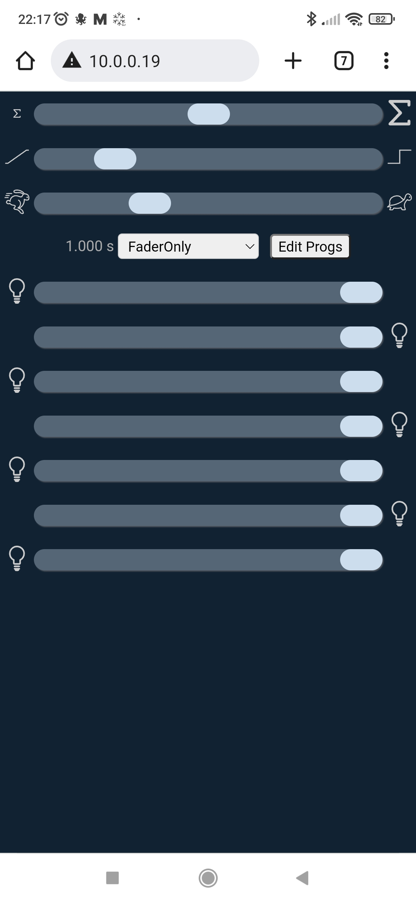
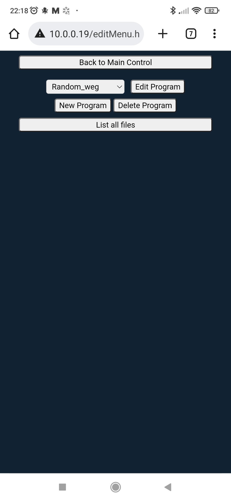
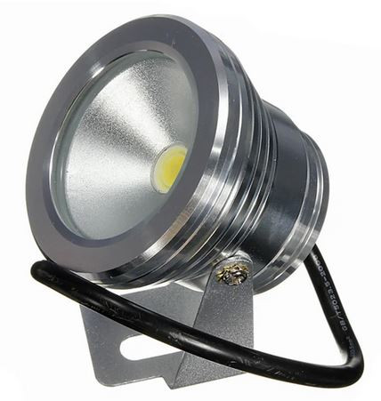

# WebSocketServer_LEDcontrol
This device can control 7 LEDs through PWM. The LEDs can be programmed
through the webpage and the programms can be stored. Running the programms,
the speed and crossfading can be adjusted. Also the total brightness can be
set. And in fader mode the brightness of each individual LED can be
adjusted or also the total brightness.

The LEDs used in this project are cheap washer lights from China which
were modified. The control chip inside has an enable/PWM input which was
directly wired to the Node-MCU board running the firmware.

To directly control the LEDs from the fader on the shown on the webpage
a websocket ist used and data is transmitted to a certain port to control the
lights.

## Screens
Main Screen / Edit Screen / Programming Screen:

  

### Main Screen
On the main screen the Fade mode can be selected to control each LED indiviually
or a program can be selected and the speed and crossfading can be set.

### Edit Screen
On the edit screen the programs can be selected to edit or delete or a new 
program can be created. There is also a button to list all files, if the
program should be stored elsewhere.

### Programming Screen
On the programming screen the sum, crossfade and speed can be selected, which
is stored together with the program. Then each fader can be controlled to
make a setting for one step of the program. Clicking on the ">"-button goes to
the next step or creates one if there isn't any next step. Steps can also be
deleted. The so created steps are all shown in a text field on the bottom. If
happy, the name of the program can be set and the programm can be saved.

## SW-Requirements
* [Arduino IDE](https://www.arduino.cc/en/main/software)
* [ESP8266 board support](https://github.com/arduino/Arduino/wiki/Unofficial-list-of-3rd-party-boards-support-urls): http://arduino.esp8266.com/stable/package_esp8266com_index.json
* WiFiManager
* WebSockets_Generic

## Hardware
The hardware consists of:
* Node-MCU (ESP8266 board) ([Wikipedia](https://de.wikipedia.org/wiki/NodeMCU))
* LEDs which can be controlled by PWM (available on [Aliexpress using the search term "10W Underwater LED Flood Wash"](https://de.aliexpress.com/w/wholesale-10W-Underwater-LED-Flood-Wash.html?SearchText=10W+Underwater+LED+Flood+Wash))

## Author
[Marco Graf](https://github.com/grafmar)

